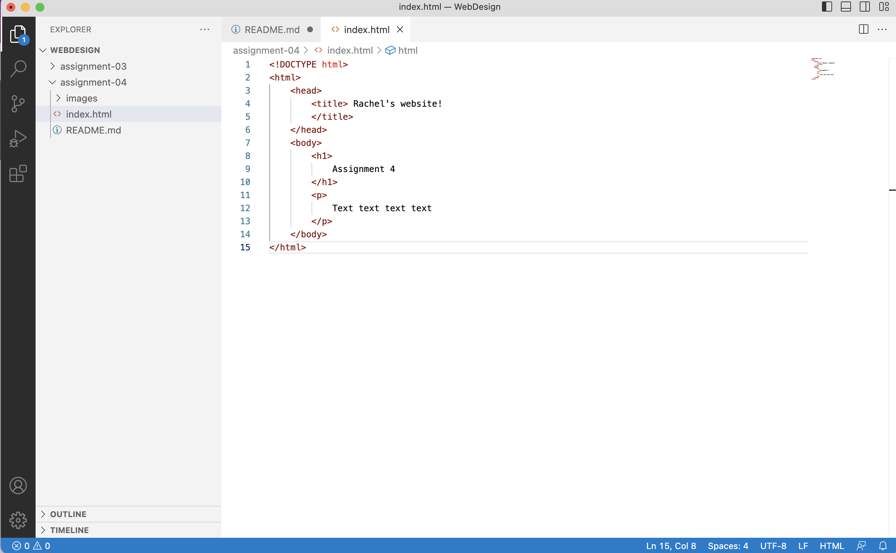

Web browsers translate code into visible, interactive content for users. 
When you type in an address, a browser sends a request to the server or servers where the content is stored.
The browser receives the content data and translates it into images and text through a rendering engine.

