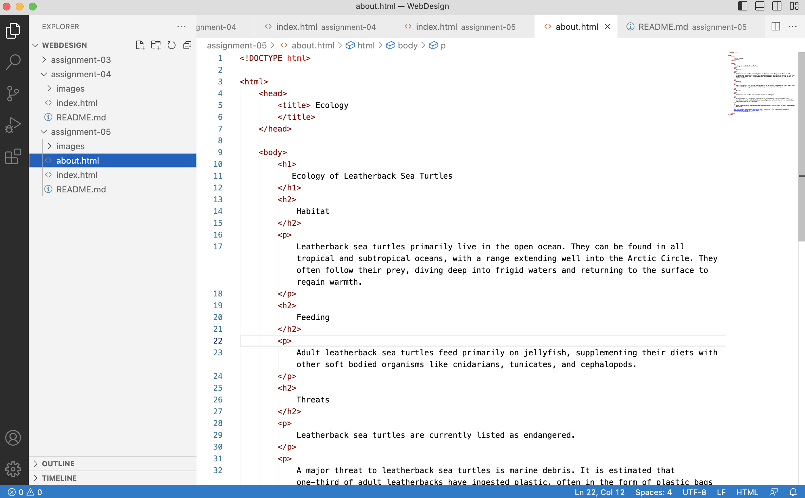

I visited Google in 2001. At first glance, the home page is similar to the current home page. There's the search bar, with links to "Google Search" and "I"m Feeling Lucky". In the 2001 version, there is a link to a tutorial of how to use Google, which is interesting knowing how intuitive it is to people now. I also noticed that the 2001 version had a "Google Web Directory" where you can browse websites by topic. I thought this was interesting, as its an idea that makes sense but seems unrealistic given the number of webpages that exist today.
