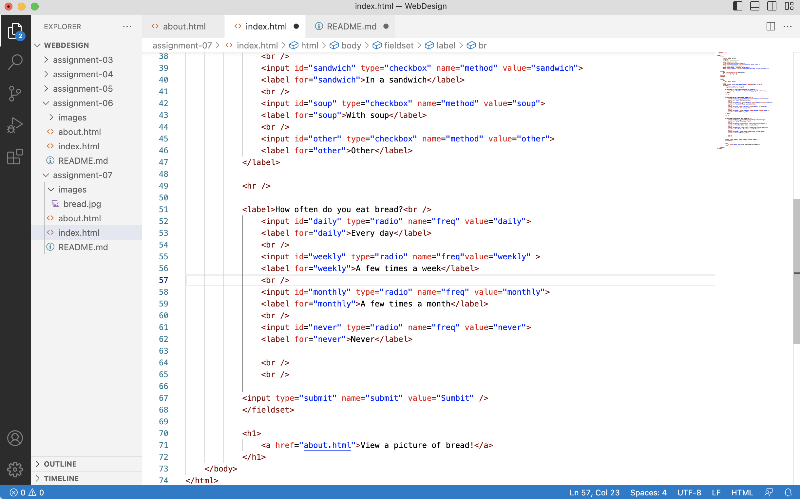

I've come across a number of forms used for account creation and login, as well as for collecting data like email addresses. I also commonly see forms used for searching. Additionally, I've found forms used to determine what information to show (like typing your zip code and seeing the nearest store to you) or as a way to conduct surveys.

