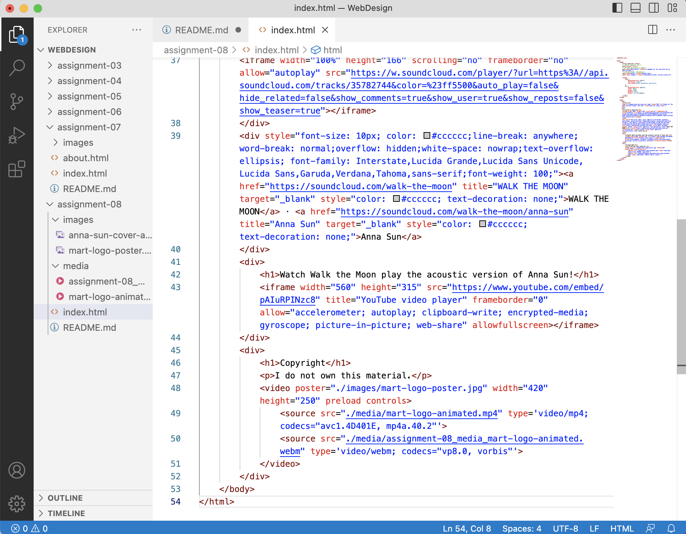

An affordance is a quality of a thing that defines its possible uses.

Using a 3rd party service to host videos is beneficial because it can handle large, high-quality versions of files and handles the details needed for play on a variety of browsers. The drawbacks are that unlicensed material used without permission can be crawled and reported and it become costly to upgrade these services

