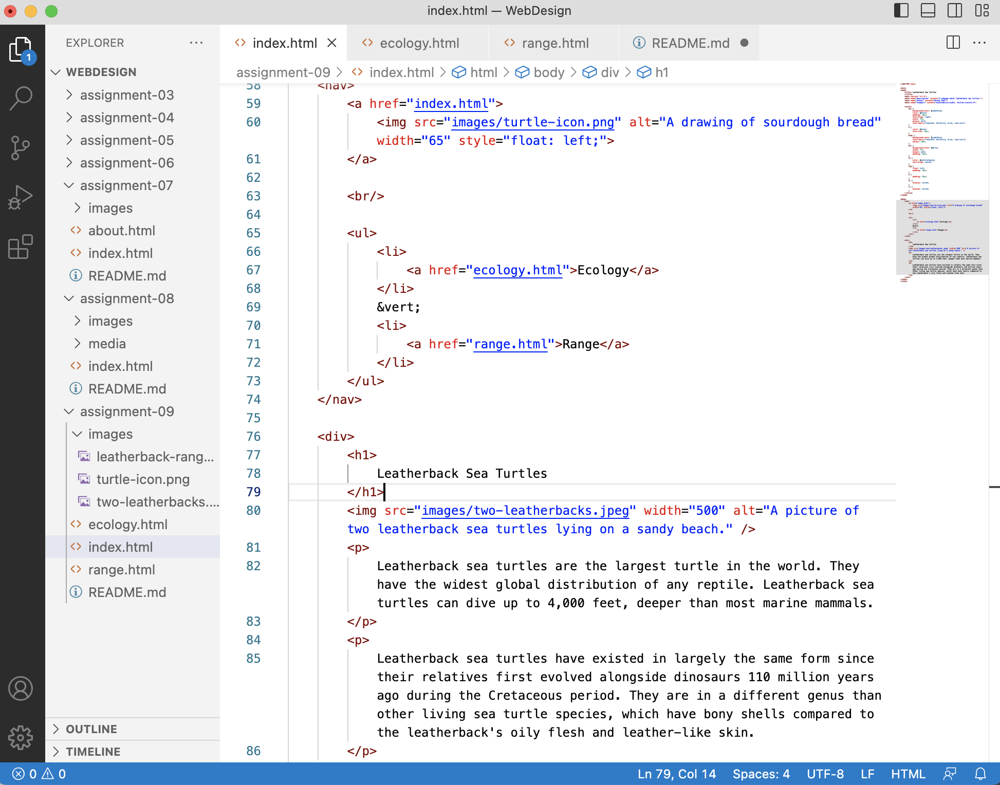

I previously had a little experience with HTML, but this course has helped me practice applying it in a variety of ways. It has been helpful to understand how the structure of pages works, and it has already been helpful in troubleshooting some websites I manage.

I look forward to having more ability to customize pages, especially diving into how to optimize a user's experience through color, typography, and further formatting.

