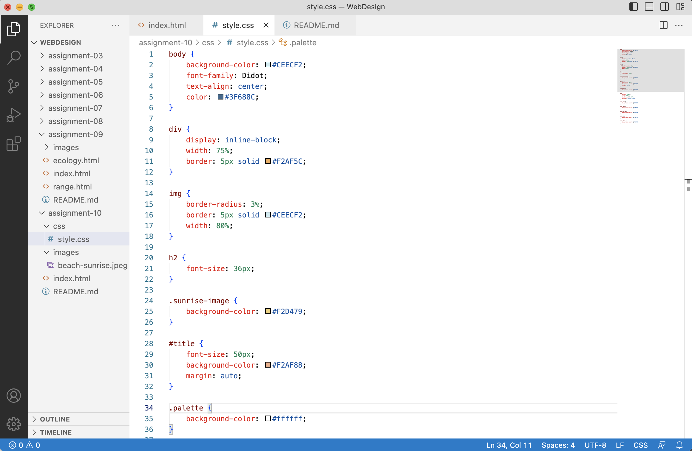

Universal selectors apply to everything on the page, and can be useful for things you might want to always have consistent, like font.
Element selectors apply rules to every instance of a certain element. This is useful when you want attributes to be consistent over every use of that element, like if you want heading 2 to always be a certain size.
Class selectors apply to specific classes of elements that serve the same function. Since class selectors can be used multiple times, they are useful for when you want different groups of elements to have the same attributes.
ID selectors apply to a single element. They are useful when you want the element to have unique attributes.

I chose my color palette by using Adobe Colors to pull hues from an image of a sunset on the beach.

