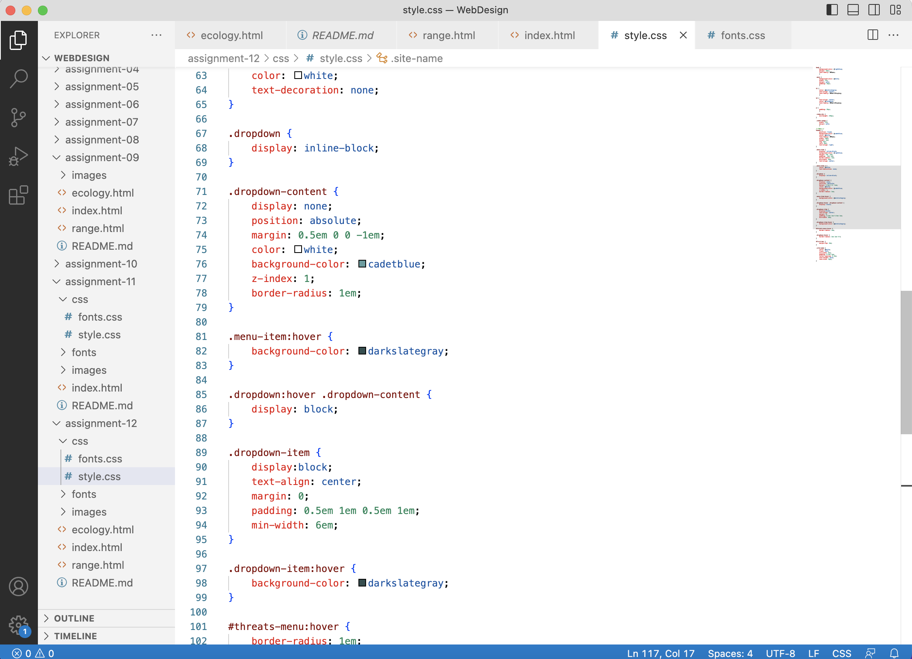

Borders are the rims that outline content. You can change their style, width, color, and radius.

Padding is the distance between the inner content and the edge of the element, where a border would appear. 

Margin is the space between an element and other elements, beyond the edges of a border..

